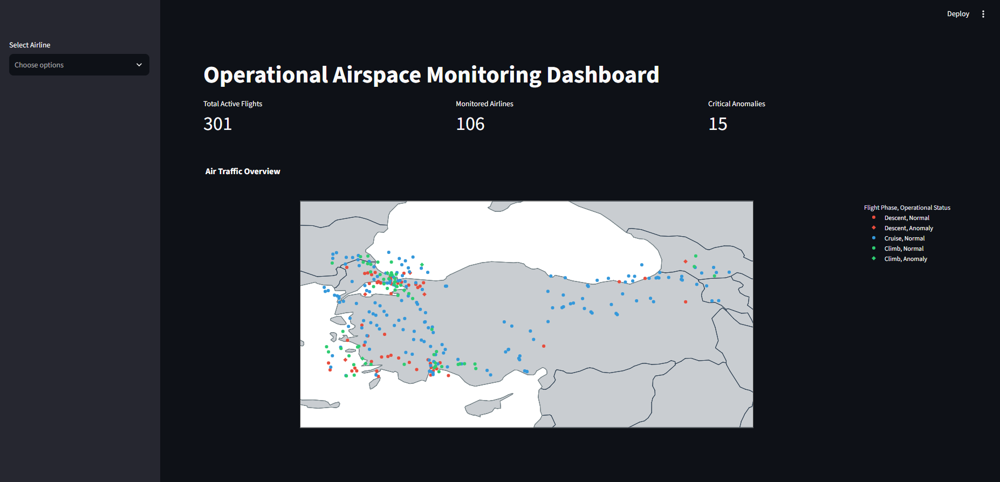
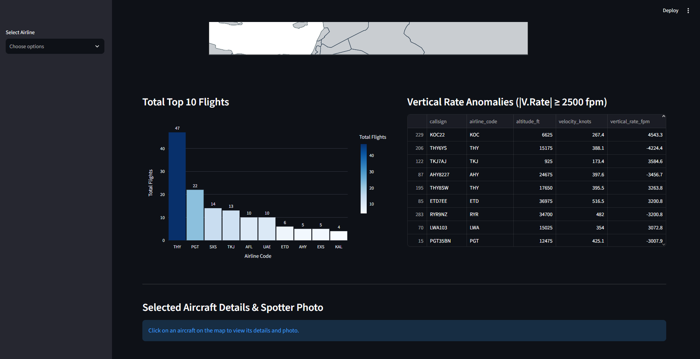

# ✈️ Operational Airspace Monitoring Dashboard

An end-to-end aviation data pipeline and interactive telemetry dashboard. The system ingests live ADS-B state vectors via OpenSky Network API, models the records into a normalized 3NF SQLite database, flags operational vertical anomalies, and visualizes air traffic with Spotter photo integration.

---

## 🖥️ Dashboard Interface

| Operational Airspace Map & Fleet Volume | Aircraft Diagnostics & Spotter Integration |
|:---:|:---:|
|  |  |

---

## 📌 Architectural Pipeline

1. **Ingestion & Custom Bounding Box (`fetcher_py.ipynb`):**
   - Fetches live state vectors from the OpenSky Network API within user-defined geographic bounding boxes (`bbox`).
   - Cleans incomplete spatial data and converts aeronautical metric units:
     - Ground Speed: $m/s \rightarrow \text{knots}$ ($\times 1.94384$)
     - Barometric Altitude: $m \rightarrow \text{feet}$ ($\times 3.28084$)
     - Vertical Rate: $m/s \rightarrow \text{fpm}$ ($\times 196.85$)
   - Saves processed state data into `temp_flights.csv`.

2. **Relational Database Modeling (`db.ipynb` & `airspace.db`):**
   - Normalizes staged telemetry into a 3NF relational SQLite schema:
     - `aircraft`: Unique 6-character ICAO24 addresses and registration countries.
     - `flights`: Callsigns, generated flight IDs, and extracted ICAO airline prefixes.
     - `telemetry_logs`: Spatial coordinates, altitude, ground speed, and vertical rates.

3. **Analytics & SQL Queries (`queries.sql` & `visualization.ipynb`):**
   - Partitions flight states into operational phases (`Climb`, `Cruise`, `Descent`) using CTEs and window functions.
   - Identifies high-density airspace sectors using 1-degree coordinate clustering.
   - Flags critical vertical climb/descent anomalies defined as $|V_{\text{rate}}| \ge 2500\text{ fpm}$.
   - `visualization.ipynb` contains Plotly figures analyzing phase distributions and speed-altitude correlations.

4. **Local Dashboard Interface (`streamlit.py`):**
   - Connects directly to `airspace.db`.
   - Renders interactive maps with airline-level filtering and telemetry diagnostics.
   - Queries Planespotters.net API dynamically via the aircraft's ICAO24 code to fetch real spotter photography.

---

## 🛠️ Tech Stack

- **Core:** Python 3.12+
- **Database:** SQLite3
- **Data Engineering:** Pandas
- **Visualization:** Plotly Express, Streamlit
- **APIs:** OpenSky Network API, Planespotters API

---

## 📂 Project Structure

```text
.
├── assets/
│   ├── airspace_overview.png  # Airspace map and metrics screenshot
│   └── details.png            # Aircraft inspection and photo screenshot
├── airspace.db                # Production 3NF SQLite database
├── fetcher_py.ipynb           # API extraction and unit conversion pipeline
├── db.ipynb                   # Database schema creation and ETL loader
├── visualization.ipynb        # Exploratory charts and visual prototypes
├── queries.sql                # Production SQL analytics queries
├── streamlit.py               # Local monitoring dashboard
├── temp_flights.csv           # Staged telemetry sample
├── requirements.txt           # Core dashboard dependencies
└── .gitignore                 # Excluded environments and cache
```

---

## ⚙️ How to Setup and Run for Any Airspace

This system is completely regional-agnostic. You can set the coordinates to monitor any airspace sector worldwide.

### 1. Environment Setup
Clone the repository and create a virtual environment:
```bash
git clone [https://github.com/ozanayz/airspace-telemetry-dashboard.git](https://github.com/ozanayz/airspace-telemetry-dashboard.git)
cd airspace-telemetry-dashboard

python -m venv venv
# On Windows:
venv\Scripts\activate
# On macOS/Linux:
source venv/bin/activate
```

### 2. Install Dependencies
```bash
pip install -r requirements.txt
pip install git+[https://github.com/openskynetwork/opensky-api.git#subdirectory=python](https://github.com/openskynetwork/opensky-api.git#subdirectory=python)
```

### 3. Change Coordinates & Ingest Your Airspace
1. Open `fetcher_py.ipynb` in VS Code or Jupyter.
2. Locate the bounding box (`bbox`) definition in Step 2:
   ```python
   # Format: (min_latitude, max_latitude, min_longitude, max_longitude)
   # Default: Türkiye coordinates
   bbox_turkey = (36.5, 42.5, 25.5, 45.0)

   states = api.get_states(bbox=(min_lat, max_lat, min_lon, max_lon))
   ```
3. Enter the coordinates of the region you wish to analyze and **run all cells**. This creates `temp_flights.csv`.
4. Open `db.ipynb` and **run all cells**. This creates/updates `airspace.db` with the newly ingested regional flights.

### 4. Inspect Results, Analytics & Visualizations
- **SQL Analytics:** Open `queries.sql` to execute the window functions, density aggregation, and anomaly queries directly in SQLite.
- **Jupyter Visualizations:** Run `visualization.ipynb` to view altitude-speed distribution plots and flight phase breakdowns.
- **Interactive UI Dashboard:** Run the following command in your terminal to launch the monitoring application:
  ```bash
  streamlit run streamlit.py
  ```
  The dashboard will open automatically in your browser (`http://localhost:8501`), displaying the telemetry, anomaly tables, and spotter photos for your chosen sector.